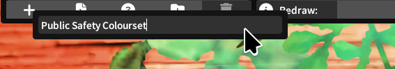
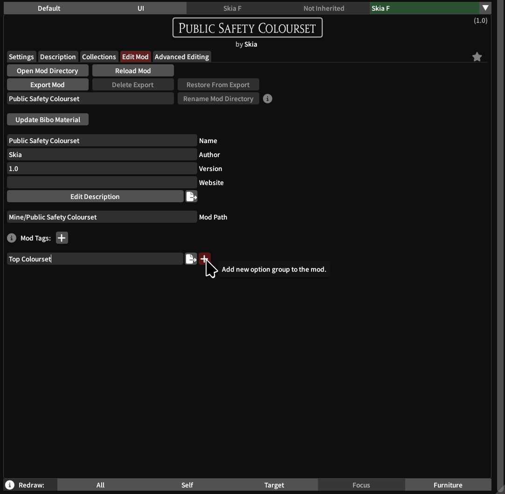
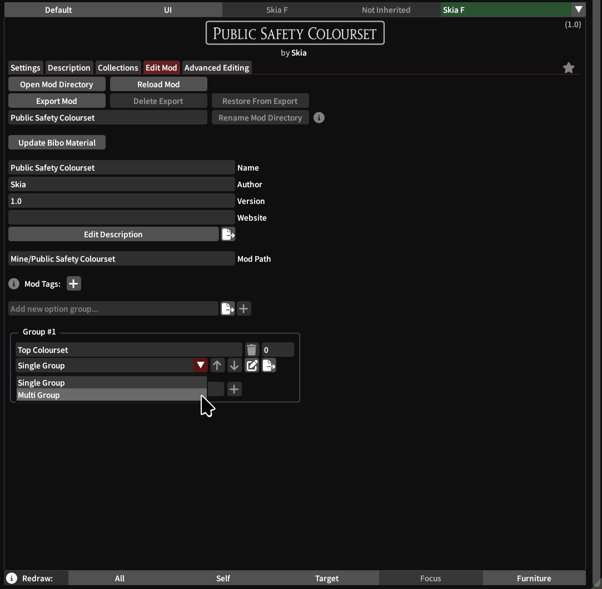
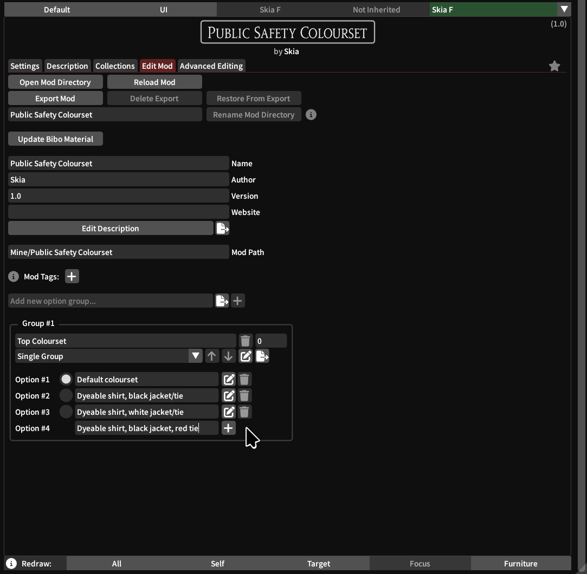
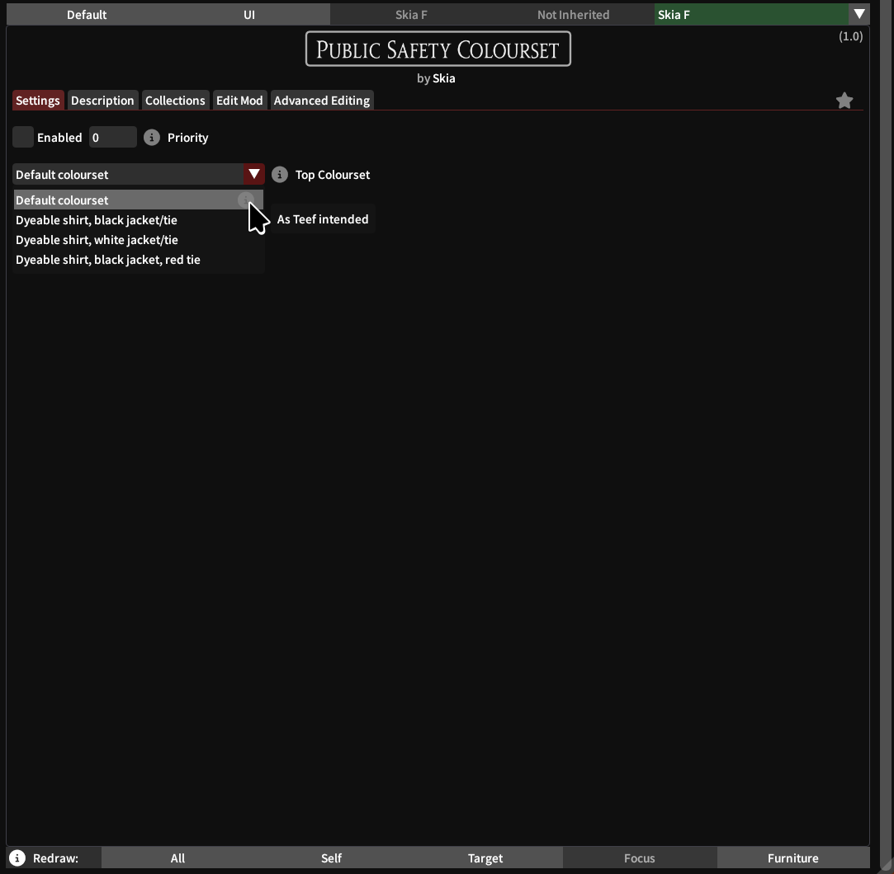
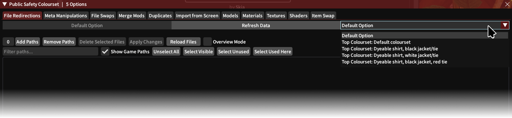
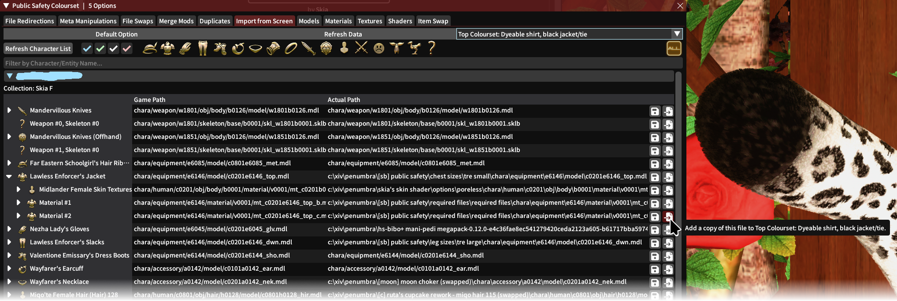
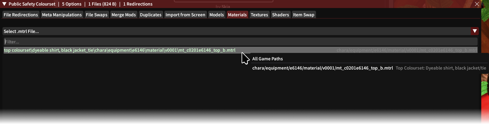
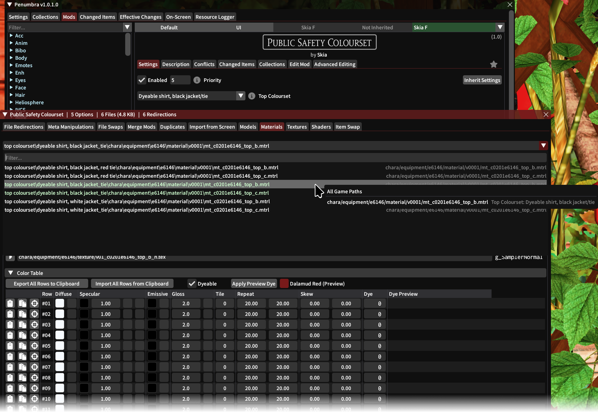

# Simple Penumbra options tutorial

Options in mods installed in Penumbra represent quick ways of applying different redirects, materials, models, textures, etc. For normal users importing TTMP modpacks, most mods will come with their own sets of options that Penumbra will automatically set up.

However, if you want to add new options or modify them, or if you're making your own mods from scratch within Penumbra, hopefully this document will help out.

All these option definitions exist in `.json` files inside your installed mod's folder. Penumbra offers a graphical way of interacting with these files and in general is the recommended way of doing so.

---

For this tutorial, we'll create from scratch a very simple mod with four options that change the colourset. I'm using [this mod](https://ko-fi.com/s/b28488251b) by [skateboards](https://ko-fi.com/sbxiv) as a demonstration, but you can do this with any mod you like. By default, with Dalamud Red dye, it looks like this:

## Step 0: Create mod

Pretty simple, just click on the <kbd>+</kbd> button in the bottom corner, and name your mod.

## Step 1: Add an option group

In the Edit Mod tab, near the bottom there will be a text input field where you can type the title of the option group.

After clicking on the <kbd>+</kbd> button, you can select between `Single Group` and `Multi Group`.

`Single Group` means that the user can only enable a single option from this group (and _must_ select one). For example, swapping between chest models or textures, or in our example, coloursets.

In `Multi Group` a user can enable multiple (or none) options from this group. This is common when, for example, you want users to be able to enable or disable separate parts of your mod (e.g. a group with one checkbox for chest, one for pants, one for shoes, etc.)

You can add as many groups and options as you need, but I recommend planning out and add them all at the start like this. At the very least, if it isn't a super simple mod, at least add one option.

The buttons to the right of the `Single`/`Multi` dropdown let you rearrange the option groups (when there's more than one group), edit or remove the description of the option group, and open your external text editor to edit the description.

## Step 2: Add options to the option group

Simply type in the name you want for your option, and click on the <kbd>+</kbd> button. You need to click the button or else the option won't be added.

For `Multi Group`, each option will show a radio button. Whichever is selected here will be the default option when you export this mod and a user installs it.

For `Single Group`, these will be checkboxes, and those checked will be enabled by default on new installs.

Here, we add four options in total. By default, the first option will be selected.

The notepad icon to the right will let you edit the description of the corresponding option. The trash can icon will, naturally, let you delete the option.

As you add options, you can go back to the `Settings` tab and review. This is how our example looks after we add all our options:

## Step 3: Add stuff to each option

Once your options are added, open the Advanced Editing tab.

Most tabs in the new window will have this dropdown on the top right that lists all your options and the groups they belong into:

Things you do in these tabs will affect whichever option is selected, so always make sure you have the correct option here.

The `Default Option` item is always available regardless of whether you add any options or not. Stuff like redirects and meta manipulations done in the `Default` will apply to your mod always, unless superseded in a different option.

For example, if your mod has variant A for a chest item disabled in `Default`, it will be disabled in any option you have, except options in which you have variant A enabled.

The `Default Option` is a good place to add redirections or metadata that will always (or most of the time) apply to your mod, for example if your mod only uses a single model but different textures/materials.

---

For our example, we're going to look for the materials used by the jacket and shirt, and add them to our first option. So we go to the `Import from Screen` tab, select `Top Colourset: Dyable shirt, black jacket/tie`, look for the materials we need, and then on the right side click `Add a copy of this file to...`. This will copy these files to our mod, under the corresponding option only.

Then, since these are material files, under the `Materials` tab we can see the files that we added:

---

We keep adding these files to the other options, except the `Top Colourset: Default colourset` since we want this particular option to retain the defaults from the original mod.

Once we add files to each option, we can see highlighted in green which files are actually currently being used by the option we have selected (a redraw may be necessary).

Then, we just go into each of these files, edit the coloursets appropriately, and save each file.

When editing any external files (e.g. textures, models, materials), we don't need to pick the appropriate option in any of the `Advanced Editing` dropdowns. However, it is still necessary when editing file redirects or meta manipulations.

---

Finally, after editing each colourset, this is the result:

